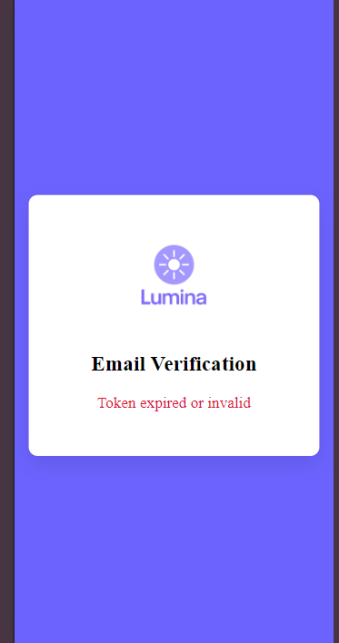

# 🌟 Lumina Email Verification Page

This is the email verification screen for the **Lumina Daily Mood App**. It is a standalone React + TypeScript frontend that handles verifying users' email addresses by processing a token sent via email.

---

## ✨ Features

- ✅ Verifies the user's email using a token in the URL (`/verify-email?token=...`)
- ✅ Uses **React Router** for route handling
- ✅ Styled with a clean, centered UI
- ✅ Displays status feedback (loading, success, or error)
- ✅ Reads API base URL from environment variables
- ✅ Designed to support mobile users (no redirect, just confirm and close)

---

## 📁 Project Structure

```
src/
├── App.tsx              # Routes and fallback screen
├── main.tsx            # Entry point
├── pages/
│   └── VerifyEmail.tsx # Email verification component
├── assets/
│   └── logo.png        # App logo
public/
└── index.html          # Base HTML file
```

---

## 🧪 How It Works

1. When a user signs up, they receive a verification link via email:

```
https://your-frontend.com/verify-email?token=abc123
```

2. This page extracts the token from the URL and sends a request to your backend:

```
GET /api/auth/verify-email?token=abc123
```

3. Depending on the response, it shows:

   - ✅ Success message
   - ❌ Error message (e.g., expired, missing or invalid token)

---

## ⚙️ Setup

### 1. Clone the repo

```bash
git clone https://github.com/yommexg/lumina-verify-email.git
cd lumina-verify-email
```

### 2. Install dependencies

```bash
npm install
```

### 3. Add your environment variable

Create a `.env` file in the root:

```ini
VITE_API_URL=http://localhost:5000
```

Or replace with your production backend:

```ini
VITE_API_URL=https://api.luminaapp.com
```

### 4. Run the app

```bash
npm run dev
```

Visit: [http://localhost:5173/verify-email?token=your_token_here](http://localhost:5173/verify-email?token=your_token_here)

---

## 📦 Technologies Used

- ⚛️ React 18 + TypeScript
- 🔄 React Router v6
- 🌐 Axios for API calls
- ⚡ Vite for fast development
- 📄 Environment variables via `import.meta.env`

---

## 🖼️ Screenshot



---

## 🚀 Deployment

You can deploy this page as a static site on:

- **Vercel**
- **Netlify**
- **Cloudflare Pages**

Just make sure to set your `VITE_API_URL` in the platform’s environment settings.

---

## 🧑‍💻 Author

Made by \Boluwatife Yomi-Olugbodi – for the Lumina Mood App.

Feel free to reach out for contributions or feedback!

---

## 🛡️ License

MIT License. Free to use and modify.
